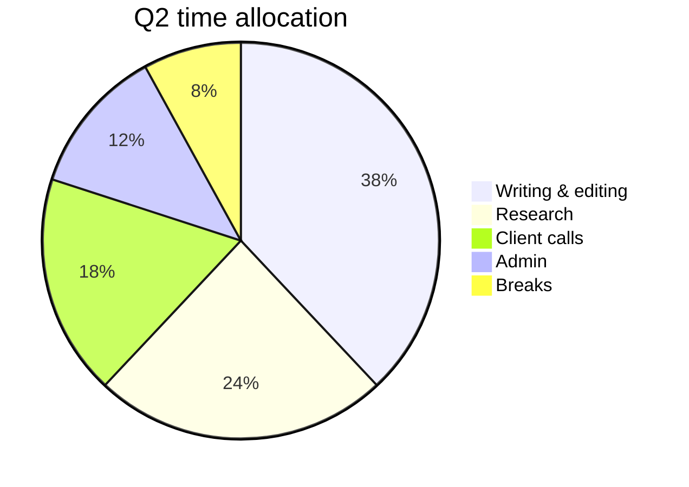
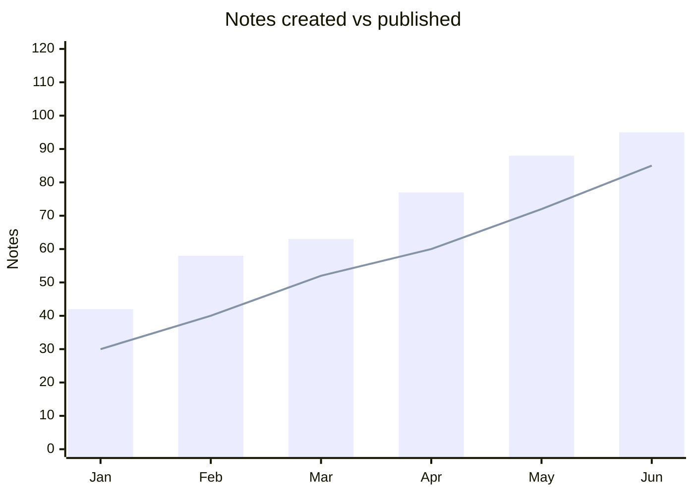

# Mermaid demo: a tiny project snapshot

Fictional but plausible data to show off three Mermaid diagram types in one note. This feature exists because users asked for it, and it is awesome to finally have Mermaid in a lightweight notes app (still a rare combo).

## Quick context

A small team keeps notes in Markdown Manager and tracks progress every month.

## Project focus (pie)

Tutorial:
<iframe src="https://www.youtube.com/embed/slhwXolN2Jc" frameborder="0"></iframe>
{: class="lazyload ytframe"}
{: class="ytframe-wrapper"}
## Simple workflow (diagram)

Tutorial:
<iframe src="https://www.youtube.com/embed/UDno58GxlHE" frameborder="0"></iframe>
{: class="lazyload ytframe"}
{: class="ytframe-wrapper"}

## Monthly activity (bar + line)

Tutorial:
<iframe src="https://www.youtube.com/embed/3J4U2GmASIM" frameborder="0"></iframe>
{: class="lazyload ytframe"}
{: class="ytframe-wrapper"}

Find more demos and examples on [Mermaid Live](https://mermaid.live/).
